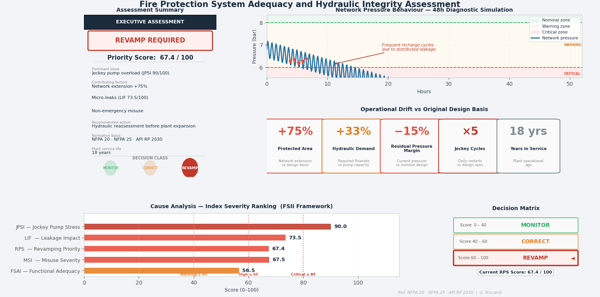

# Firefighting System Continuity
### Reading weak signals in industrial firefighting networks

Industrial firefighting systems represent one of the most critical safety infrastructures within industrial plants.

Their purpose is to guarantee adequate pressure and flow during emergency scenarios, ensuring that the final safety barrier of the facility remains effective when all other protection layers have already failed.

However, in many industrial sites firefighting networks were originally designed for plant configurations that have significantly evolved over time.

New process lines, additional tanks, expanded logistics areas and infrastructure modifications progressively alter the hydraulic distribution of the network.

The fire protection system may continue to operate apparently without issues, but the **operating conditions of the network may slowly drift away from the original design scenario**.

---

# Engineering Context

Most industrial plants currently in operation are the result of several generations of engineering decisions.

Earlier designs often prioritized:

- mechanical robustness  
- construction simplicity  
- protection of piping infrastructure  

Solutions such as **fully buried pipelines** were frequently adopted to protect the network and reduce interference with plant operations.

While technically appropriate at the time, these configurations can make inspection and early leak detection significantly more difficult decades later.

Industrial plants therefore carry the **engineering legacy of their own historical development**.

---

# Weak System Signals

Firefighting networks rarely fail suddenly.

Instead, they often generate subtle operational signals indicating that the hydraulic balance of the system is changing.

Typical indicators may include:

- increasing jockey pump start frequency  
- more frequent pressure drops in the network  
- longer pressure recovery times  
- distributed micro-leaks along the system  

Individually, these phenomena may appear as routine maintenance issues.

Observed together, however, they can indicate a **progressive drift in the hydraulic equilibrium of the network**.

---

# Engineering Interpretation

A firefighting network can be interpreted as a dynamic system balancing:

- network volume  
- distributed hydraulic losses  
- pressurization capacity  

The jockey pump plays a key role in maintaining system pressure.

When its operating cycles increase over time, this behaviour can act as an **indirect signal that the equilibrium of the system is changing**.

This does not necessarily indicate a single failure, but rather the gradual evolution of the plant infrastructure.

---

# Asset Management Implications

Intervening on firefighting networks is rarely a simple maintenance action.

In many industrial facilities these systems are directly linked to safety compliance and operating permits.

Temporary shutdowns for inspection, repair or revamping can therefore impact plant continuity and production schedules.

For this reason, early detection of weak operational signals has strategic value.

Identifying system drift months in advance allows engineers and plant managers to:

- plan interventions  
- coordinate with operations  
- avoid emergency shutdowns  
- preserve the integrity of safety systems  

---

# Connection to OMI

This case study reflects the principles behind **OMI – Original Maintenance Insight**.

Industrial systems often reveal their evolving condition through subtle operational signals long before failures occur.

Learning how to observe and interpret these signals allows engineers and asset managers to move from reactive maintenance toward **anticipatory system management**.

---

# Key Takeaway

Firefighting networks are not static infrastructures.

They are dynamic systems that evolve together with the plant.

Reading weak operational signals allows engineers to understand when the system is gradually moving away from its original design equilibrium and to intervene before safety or operational continuity are compromised.
