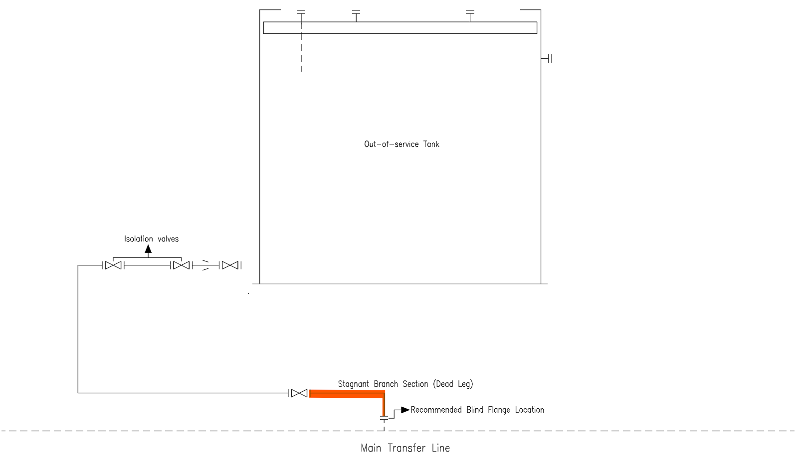

# Dead Legs in Industrial Pipelines
### Hidden integrity risks in evolving industrial plants

Industrial plants continuously evolve.

New process units are installed, equipment is replaced, bypass lines are introduced, and temporary solutions sometimes become permanent parts of the infrastructure.

Over time these changes may generate pipeline segments with **very low or zero flow conditions**, commonly referred to as **dead legs**.

Although often overlooked, dead legs can become critical locations for degradation mechanisms that threaten the long-term integrity of industrial piping systems.

## Example Configuration

Example of a pipeline branch connected to equipment no longer in service.  
When these sections remain isolated by valves, stagnant zones may develop and create long-term integrity risks such as corrosion, contamination or residual pressure retention.

---

# System Context

Industrial piping networks rarely remain identical to their original design configuration.

Plant expansions, equipment replacement, operational changes and maintenance modifications frequently introduce new branches, bypasses, sampling points or temporary connections.

When these elements are no longer actively used but remain connected to the system, they can create **stagnant zones where fluid movement becomes minimal or absent**.

These stagnant zones are typically known as **dead legs**.

Dead legs are not necessarily design errors.  
They are often the natural consequence of decades of plant evolution.

However, their presence can introduce hidden integrity risks within otherwise healthy systems.

---

# Observed Signals

Dead legs often remain unnoticed during routine plant operation because they do not immediately affect system performance.

However, several weak signals may indicate their presence:

- pipeline branches no longer actively used
- isolated instruments or sampling lines
- redundant bypass connections
- sections of piping with extremely low flow velocity
- localized corrosion patterns
- accumulation of deposits or contaminants

Individually these conditions may appear minor.

From a system perspective, however, they can reveal **areas where the hydraulic and chemical behaviour of the fluid differs significantly from the rest of the network**.

---

# Engineering Interpretation

From a fluid and materials engineering perspective, dead legs create conditions that favour degradation mechanisms.

When flow velocity approaches zero, several processes may occur:

- corrosion acceleration due to stagnant conditions
- sedimentation and deposit formation
- microbial growth in some fluids
- accumulation of contaminants
- localized chemical concentration effects

Because these phenomena develop slowly, dead legs often become **long-term integrity risks rather than immediate operational problems**.

Their detection therefore requires an engineering approach focused on **system behaviour rather than isolated equipment performance**.

---

# Asset Management Implications

From an Industrial Asset Management perspective, dead legs represent a structural characteristic of evolving plants.

They highlight how industrial systems accumulate complexity over time.

Managing these areas typically requires a combination of actions such as:

- identifying dead legs during piping system reviews
- evaluating flow conditions in low-velocity branches
- integrating dead leg locations into inspection programs
- removing or permanently isolating redundant lines when possible

The objective is not necessarily to eliminate every dead leg, but to **understand their impact on long-term system integrity**.

---

# Connection to OMI Framework

This case study relates to the **OMI – Original Maintenance Insight** framework.

OMI is based on the idea that industrial systems often produce **subtle signals indicating shifts in their internal equilibrium long before failures occur**.

Dead legs represent one of these signals.

They show how plant evolution can create hidden zones where degradation processes may silently develop.

Recognizing these structural weak points allows engineers and asset managers to move from reactive maintenance toward **system-aware asset management**.

---

# Key Insight

Industrial plants rarely fail suddenly.

More often, they accumulate small structural conditions where degradation slowly develops.

Dead legs are one example of how **plant evolution leaves traces in the infrastructure**, and how engineering observation can transform those traces into valuable insight for long-term reliability.

---

# Author

**Gianluigi Riccardi**

Industrial Systems  
Reliability Engineering  
Industrial Asset Management  
System Thinking in Complex Plants
